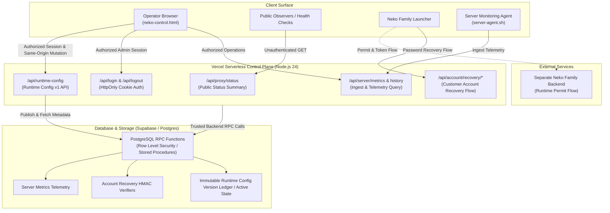

# Neko Control Room

[](https://nodejs.org/)
[](#testing)
[](https://neko-control-room.vercel.app/api/proxy/status)
[](SECURITY.md)

Public repository and administration control plane for **Neko Family Proxy**, running on Vercel Node.js Serverless Functions with Supabase as the high-integrity state store.

* **Production Control Room:** [https://neko-control-room.vercel.app](https://neko-control-room.vercel.app)
* **Public Proxy Status Endpoint:** `https://neko-control-room.vercel.app/api/proxy/status`

---

## Overview

Neko Control Room coordinates operator administrative operations, health probing, server metrics aggregation, and customer account recovery workflows for the Neko Family Proxy ecosystem.

The system is designed under a strict **server-side secret boundary** security model:
* **Single-Origin Deployment:** The administrative single-page dashboard (`standalone/dist/neko-control.html`) and backend endpoints (`/api/*`) are hosted together on Vercel.
* **Confidential Backend Operations:** Database service-role credentials and administrative session keys are strictly confined to backend execution environments. Service-role and database authority remain server-only, and API responses never return secret-bearing proxy configuration or customer secrets.
* **Safe Public Observability:** Unauthenticated public consumers can query sanitized, aggregate proxy operational health via `/api/proxy/status` without exposing internal topology or private server identifiers.

---

## System Architecture



---

## Runtime Config v1

The **Runtime Config v1** control plane enables dynamic, centralized coordination of proxy routing configurations across authorized operators and infrastructure endpoints via `/api/runtime-config`.

### Conceptual Architecture
* **Strict Authentication Boundary:** Access to runtime configuration requires a valid administrative session (`401 Unauthorized` returned for unauthenticated requests).
* **Sanitized Metadata Exposure:** The API response returns safe metadata only:
  * `config_version` (positive monotonic integer sequence)
  * `endpoint_id` (bounded ASCII identifier)
  * `published_at` (ISO 8601 UTC timestamp)
* **Server-Side Authority & Secret Isolation:** Database service-role credentials and administrative session keys are strictly confined to backend execution environments. Service-role/database authority stays server-only, and API responses never return secret-bearing proxy configuration.
* **Server-Side Ledger State:** The runtime configuration version ledger is immutable and versioned server-side. POST operations require an authorized Admin session plus same-origin mutation checks, accepting the complete new runtime configuration payload server-side for publication through the trusted backend/RPC functions.

---

## API Endpoints Reference

| Endpoint | Method | Auth Required | Description |
| :--- | :--- | :--- | :--- |
| `/api/health` | `GET` | No | Basic health check (`200 OK`) |
| `/api/proxy/status` | `GET` | No | Public aggregate health summary (`200 OK`) |
| `/api/login` | `POST` | No | Authenticate admin operator; sets secure HttpOnly cookie |
| `/api/logout` | `POST` | No | Invalidate admin session; clears HttpOnly cookie |
| `/api/account/recovery/verify` | `POST` | No | Verify customer recovery code and issue recovery session |
| `/api/account/recovery/change-password` | `POST` | Bearer Token (Recovery Session) | Reset password using recovery session token |
| `/api/server/metrics/ingest` | `POST` | Bearer Token (Shared Secret) | Server monitoring agent telemetry ingest (also `/api/server/metrics`) |
| `/api/server/metrics` | `GET` | Yes (Admin Session) | Retrieve latest server metrics snapshot |
| `/api/server/metrics/history` | `GET` | Yes (Admin Session) | Operator historical telemetry queries |
| `/api/runtime-config` | `GET` | Yes (Admin Session) | Retrieve safe Runtime Config v1 metadata (`401` if unauthenticated) |
| `/api/runtime-config` | `POST` | Yes (Admin Session + Same-Origin) | Publish runtime configuration payload server-side; returns safe metadata |

---

## Environment Variables

All sensitive values must be configured via Vercel Environment Variables or your deployment environment. Service and database credentials must remain strictly server-only. **Never commit actual secrets or credentials to version control.**

| Variable Name | Required | Description / Purpose |
| :--- | :--- | :--- |
| `SUPABASE_URL` | Yes | Supabase project endpoint URL |
| `SUPABASE_SECRET_KEY` | Yes | Server-only service role key for database operations |
| `ADMIN_SESSION_SECRET` | Yes | Server-only secret (minimum 32 bytes) for signing admin cookies |
| `ACCOUNT_RECOVERY_HMAC_SECRET` | Yes | Server-only secret (minimum 32 bytes) for recovery verification HMACs |
| `SERVER_METRICS_INGEST_SECRET` | Yes | Server-only shared secret for edge monitoring agent telemetry ingestion |
| `ADMIN_SESSION_TTL_MS` | No | Optional admin session lifespan in milliseconds |
| `SERVER_NETWORK_CAPACITY_BPS` | No | Optional rated upstream network capacity in bits per second |

---

## Repository Structure

```text
.
├── .github/
│   ├── ISSUE_TEMPLATE/             # Bug report, feature request, and issue configuration
│   └── PULL_REQUEST_TEMPLATE.md    # Pull request quality gate and checklist
├── agent/
│   ├── server-agent.sh             # Linux telemetry probe agent
│   └── server-agent.env.example    # Agent configuration template
├── api/
│   └── index.mjs                   # Vercel Serverless Function entry point & router
├── docs/
│   ├── current/                    # Active operational runbooks and launcher contracts
│   └── archive/                    # Historical references and completed phase proofs
├── scripts/
│   └── build-standalone.mjs        # Static single-file HTML bundler using esbuild
├── server/
│   ├── account-recovery.mjs        # HMAC verification & recovery lifecycle
│   ├── admin.mjs                   # Operator authentication handlers
│   ├── auth.mjs                    # Cryptographic cookie tokens & verification
│   ├── config.mjs                  # Environment validation & secret boundary enforcement
│   ├── dashboard.mjs               # Operator dashboard statistics aggregation
│   ├── public-proxy-status.mjs     # Public health & load classification
│   ├── runtime-config.mjs          # Runtime Config v1 validation & metadata sanitizer
│   ├── server-metrics.mjs          # Telemetry ingest, downsampling, and snapshot storage
│   └── supabase.mjs                # Supabase client wrapper & RPC caller
├── standalone/
│   ├── src/                        # Standalone admin UI source (HTML/CSS/Vanilla JS)
│   └── dist/                       # Output single-file admin web app (neko-control.html)
├── tests/                          # Automated Node.js native test suite (103 tests)
├── CHANGELOG.md                    # Project release and iteration history
├── CONTRIBUTING.md                 # Contribution workflows, security gates, and standards
├── package.json                    # Project configuration (Node 24.x)
├── README.md                       # Public project documentation
├── SECURITY.md                     # Vulnerability reporting and security architecture
└── vercel.json                     # Vercel deployment routes and build specifications
```

---

## Development and Testing

### Prerequisites
* **Node.js**: `24.x` (LTS recommended)
* **npm**: `10.x` or later

### Installation
```bash
npm install
```

### Build
Compile the standalone admin UI bundle (`standalone/dist/neko-control.html`):
```bash
npm run build
```

### Testing
Execute the complete regression and security test suite (103 tests):
```bash
npm test
```

Test verification covers:
* Public proxy status health endpoint (`/api/proxy/status` returns `200 OK` with load score)
* Runtime Config v1 metadata isolation and unauthorized access rejection (`401 Unauthorized`)
* Administrative session authentication and cookie security attributes
* Account recovery HMAC hashing, expiration limits, and single-use invalidation
* Privacy and data sanitization boundaries (preventing leakage of internal hostnames or tokens)

---

## Security and Ecosystem Links

* **Security Policy & Vulnerability Reporting:** See [SECURITY.md](SECURITY.md)
* **Contribution Guidelines:** See [CONTRIBUTING.md](CONTRIBUTING.md)
* **Project Changelog:** See [CHANGELOG.md](CHANGELOG.md)
* **Launcher Account Recovery Contract:** See [docs/current/LAUNCHER_ACCOUNT_RECOVERY_CONTRACT.md](docs/current/LAUNCHER_ACCOUNT_RECOVERY_CONTRACT.md)
* **Closed Beta Operator Runbook:** See [docs/current/closed-beta-operator-runbook.md](docs/current/closed-beta-operator-runbook.md)
