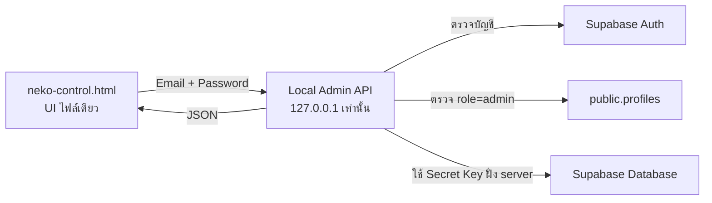
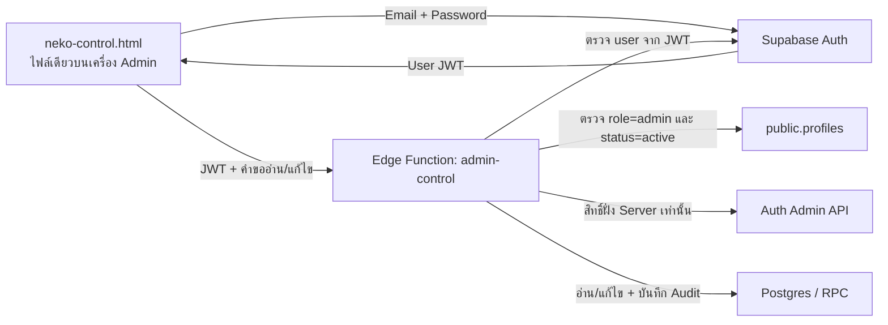

# แผนย้าย Neko Control เป็นไฟล์ HTML เดียว

สถานะเอกสาร: Rebuild รอบแรกเสร็จแล้ว เหลือทดสอบกับ Supabase จริงก่อนใช้งาน  
ขอบเขต: ถอดการล็อกอินและ Access Control ของ ChatGPT Sites ออกจากเว็บหลังบ้าน แล้วสร้างไฟล์เว็บ `neko-control.html` เพียงไฟล์เดียวสำหรับนำไปรันเอง

> **ข้อสรุปเพิ่มเติม (ฉบับง่าย):** ให้ใช้แผน “HTML + Local Admin API” เป็นค่าเริ่มต้น
> โดยล็อกอินด้วย Supabase Email/Password และตรวจเฉพาะ `profiles.role = 'admin'`
> ส่วนแนวทาง
> Edge Function ในหัวข้อถัดไปเก็บไว้เป็นทางเลือกเมื่อจำเป็นต้องเปิดใช้งานจากหลายเครื่อง
> หรือเปิดผ่านอินเทอร์เน็ต

## 0. Flow แบบง่ายที่แนะนำ



### การทำงาน

1. ผู้ดูแลเปิด Local Admin API บนเครื่องตัวเอง
2. เปิด `neko-control.html` หรือหน้า localhost ที่เสิร์ฟไฟล์นี้
3. กรอก Email และ Password ของ Supabase Auth
4. API ตรวจบัญชีกับ Supabase Auth และอ่าน `profiles.role`
5. ถ้า role เป็น `admin` API จะออก session ชั่วคราว
6. HTML เรียก API เพื่อโหลดภาพรวม สมาชิก License คูปอง เซสชัน และ Audit
7. เมื่อกดคำสั่งแก้ไข API เป็นผู้เรียก Supabase และตรวจ session ก่อนทุกครั้ง
8. กดออกจากระบบเพื่อล้าง session

### ขอบเขตความปลอดภัยของฉบับง่าย

- API bind ที่ `127.0.0.1` เท่านั้น ห้าม bind `0.0.0.0`
- ห้าม port-forward หรือเปิด router ให้เข้าจากอินเทอร์เน็ต
- `SUPABASE_SECRET_KEY` อยู่ใน `.env` ของ Local Admin API เท่านั้น
- HTML ไม่เก็บ Supabase key และไม่มี ChatGPT account/headers
- ไม่เก็บรหัส Admin เพิ่มใน `.env`; ใช้บัญชี Supabase ที่มีอยู่แล้ว
- ตรวจสิทธิ์เฉพาะ `role = 'admin'` ไม่ตรวจ email allowlist หรือ `status`
- session หมดอายุเมื่อปิด server หรือครบเวลาที่กำหนด
- ถ้าภายหลังต้องใช้หลายเครื่อง ให้ย้าย Local API ไป Edge Function ตามแผนทางเลือก

## 0.1 การแยก source เพื่อบำรุงรักษา

แม้ไฟล์ที่ส่งมอบจะเป็น HTML ไฟล์เดียว แต่ source ไม่รวมเป็นไฟล์ยักษ์เดียว:

```text
admin-web/
  standalone/
    src/
      main.js              # จุดเริ่มต้นและ event หลัก
      config.js            # URL ของ Local Admin API
      api.js               # fetch/จัดการ error ของ API
      session.js           # login, logout, timeout
      state.js              # state กลางของ dashboard
      router.js             # เปลี่ยน section
      ui/
        layout.js
        table.js
        modal.js
        toast.js
      sections/
        overview.js
        users.js
        licenses.js
        coupons.js
        sessions.js
        audit.js
      styles.css
    index.html             # shell สำหรับ build
    dist/neko-control.html # output ไฟล์เดียว
  admin-api/
    src/
      server.mjs            # static server + API server
      auth.mjs              # Supabase login, role และ session
      supabase.mjs          # เรียก Supabase ด้วย secret ฝั่ง server
      routes/
        admin.mjs           # resource และ actions ทั้งหมด
    .env.example
```

กติกาการแก้ไข:

- แก้หน้าตาใน `standalone/src/ui` หรือ `standalone/src/sections`
- แก้การเรียกข้อมูลใน `standalone/src/api.js`
- แก้สิทธิ์และ Supabase ใน `admin-api/src`
- ไม่แก้ไฟล์ `dist/neko-control.html` ด้วยมือ ให้สร้างจาก build ทุกครั้ง

## 0.2 API ขั้นต่ำของ Local Admin API

ให้ใช้ API ชุดเล็กและคงรูปแบบเดิมไว้ เพื่อให้ย้าย UI ได้ง่าย:

```text
GET  /api/health
POST /api/login
POST /api/logout
GET  /api/admin?resource=overview|users|licenses|coupons|sessions|audit
POST /api/admin
```

รายละเอียด:

- `POST /api/login` รับ Supabase Email/Password ตรวจ `role=admin` แล้วตั้ง HttpOnly session cookie
- `POST /api/logout` ล้าง cookie และ session ฝั่ง server
- `GET /api/admin` ใช้โหลดข้อมูลแต่ละ section
- `POST /api/admin` ใช้คำสั่งเดิม เช่น revoke, extend และ generate coupons
- ให้ Local Admin API เสิร์ฟ `dist/neko-control.html` ที่ `/` ด้วย เพื่อให้เป็น origin เดียวและไม่ต้องทำ CORS ซับซ้อน

## 1. เป้าหมาย

- ไม่ใช้บัญชี ChatGPT, GPT User ID, `oai-authenticated-user-*` headers หรือระบบ allowlist ของ ChatGPT Sites
- ผู้ดูแลล็อกอินด้วย Email/Password ของ Supabase Auth
- อนุญาตเมื่อ `public.profiles.role = 'admin'` โดยไม่ใช้ allowlist และไม่ตรวจ `status`
- ไฟล์ที่ผู้ดูแลนำไปใช้เป็น HTML ไฟล์เดียว มี HTML, CSS และ JavaScript รวมอยู่ภายใน
- รองรับหน้าเดิม: ภาพรวม สมาชิก สิทธิ์ใช้งาน คูปอง เซสชัน และ Audit log
- ห้ามมี Supabase Secret Key หรือ Service Role Key อยู่ในไฟล์ HTML

## 2. ข้อจำกัดด้านความปลอดภัย

ไฟล์ HTML เป็นฝั่งผู้ใช้และผู้ที่ได้รับไฟล์สามารถอ่าน source ได้ทั้งหมด ดังนั้นภายในไฟล์ไม่ควรมี credential ของ Supabase ใด ๆ:

- URL ของ Local Admin API เช่น `http://127.0.0.1:8787`
- โค้ด UI เท่านั้น

สำหรับแผนหลัก ข้อมูลต่อไปนี้ต้องอยู่ฝั่ง Local Admin API เท่านั้น:

- Supabase Secret Key หรือ Service Role Key
- การเรียก Auth Admin API เพื่ออ่านรายชื่อผู้ใช้และอีเมล
- คำสั่งที่แก้สถานะสมาชิก สิทธิ์ใช้งาน คูปอง และเซสชันด้วยสิทธิ์สูง

ห้ามแก้ปัญหาโดยฝัง Secret Key ใน HTML แม้จะตั้งใจเปิดไฟล์บนเครื่องของผู้ดูแลเพียงเครื่องเดียว

## 3. สถาปัตยกรรมทางเลือกเมื่อไม่ใช่ Local-only

หัวข้อนี้ใช้เมื่อภายหลังต้องให้หลายเครื่องหรือผู้ดูแลหลายคนเข้าเว็บจากภายนอก
เท่านั้น สำหรับการใช้งานในเครื่องเดียวให้ใช้ Flow ในหัวข้อ 0



เหตุผลที่ใช้ Edge Function:

- หน้าเดิมต้องอ่านอีเมลจาก `auth.users` ซึ่ง browser ใช้ Publishable Key อ่านไม่ได้
- คำสั่ง Admin หลายรายการต้องข้าม RLS แต่ต้องข้ามหลังจากตรวจตัวตนและ role แล้วเท่านั้น
- สามารถเก็บ Secret Key ไว้ฝั่ง server โดยไม่ส่งให้ไฟล์ HTML

## 4. Flow ของสถาปัตยกรรมทางเลือก

หัวข้อนี้เป็น flow ของ Edge Function + Supabase Auth สำหรับกรณีที่ต้องเปิดใช้งาน
จากหลายเครื่องหรือจากอินเทอร์เน็ต ไม่ใช่ flow เริ่มต้นของการรันบนเครื่องเดียว

### 4.1 เปิดเว็บ (ทางเลือก)

1. ผู้ดูแลเปิด `neko-control.html`
2. JavaScript สร้าง Supabase client ด้วย URL และ Publishable Key
3. ตรวจ Supabase session ที่บันทึกไว้ในเครื่อง
4. ถ้าไม่มี session ให้แสดงหน้าล็อกอิน
5. ถ้ามี session ให้เรียก `admin-control?action=viewer`

### 4.2 ล็อกอิน (ทางเลือก)

1. ผู้ดูแลกรอกอีเมลและรหัสผ่าน
2. HTML เรียก `supabase.auth.signInWithPassword`
3. Supabase คืน User JWT
4. HTML ส่ง JWT ไปยัง Edge Function
5. Edge Function ตรวจ JWT กับ Supabase Auth
6. Edge Functionอ่าน `public.profiles` จาก `user.id`
7. อนุญาตเมื่อ `role = 'admin'` และ `status = 'active'`
8. หากไม่ผ่าน ให้คืน `403`, ล้าง session และแสดง “บัญชีนี้ไม่มีสิทธิ์ผู้ดูแลระบบ”

### 4.3 โหลดข้อมูล (ทางเลือก)

1. HTML ส่ง `GET` ไปที่ Edge Function พร้อม `Authorization: Bearer <user JWT>`
2. Edge Function ตรวจผู้ใช้และสิทธิ์ Admin ทุกคำขอ ห้ามเชื่อ role ที่ browser ส่งมา
3. Edge Function โหลดข้อมูลตาม resource:
   - `overview`
   - `users`
   - `licenses`
   - `coupons`
   - `sessions`
   - `audit`
4. Edge Function คืน JSON ที่ไม่มี Secret Key หรือข้อมูลลับเกินความจำเป็น
5. HTML render ตารางและสถานะต่าง ๆ

### 4.4 คำสั่ง Admin (ทางเลือก)

1. ผู้ดูแลกดคำสั่งใน UI
2. UI ขอการยืนยันสำหรับคำสั่งที่ย้อนกลับยาก
3. HTML ส่ง `POST` พร้อม JWT และ payload ที่ตรวจรูปแบบแล้ว
4. Edge Function ตรวจ JWT, `role`, `status` และ payload ซ้ำ
5. Edge Function ทำคำสั่งภายใน transaction/RPC เมื่อจำเป็น
6. บันทึก Audit event พร้อม `admin_user_id`, action, target และเวลา
7. คืนผลลัพธ์ แล้ว HTML โหลดข้อมูลส่วนที่เกี่ยวข้องใหม่

คำสั่งที่ต้องย้ายจาก Next.js API เดิม:

- เปลี่ยนสถานะสมาชิก
- ยกเลิก License
- ต่ออายุ License
- ยกเลิก Launcher session
- ยกเลิก Coupon batch
- สร้าง Coupon batch และคืน plaintext coupon เพียงครั้งเดียว

### 4.5 ออกจากระบบ

1. ผู้ดูแลกด “ออกจากระบบ”
2. HTML เรียก `supabase.auth.signOut()`
3. ล้างข้อมูล dashboard และ token จากหน่วยความจำ
4. กลับไปหน้าล็อกอิน Supabase

## 5. รูปแบบ API ของ Edge Function (ทางเลือก)

ใช้ Edge Function เดียวชื่อ `admin-control` เพื่อให้ดูแลง่าย:

### อ่านข้อมูล

```text
GET /functions/v1/admin-control?resource=overview
GET /functions/v1/admin-control?resource=users
GET /functions/v1/admin-control?resource=licenses
GET /functions/v1/admin-control?resource=coupons
GET /functions/v1/admin-control?resource=sessions
GET /functions/v1/admin-control?resource=audit
GET /functions/v1/admin-control?resource=viewer
```

### แก้ไขข้อมูล

```json
{ "action": "set_user_status", "userId": "...", "status": "suspended" }
{ "action": "revoke_license", "licenseId": "..." }
{ "action": "extend_license", "licenseId": "...", "days": 30 }
{ "action": "revoke_session", "sessionId": "..." }
{ "action": "revoke_batch", "batchId": "..." }
{ "action": "generate_coupons", "productCode": "neko-family-proxy", "durationDays": 30, "quantity": 10 }
```

ทุก endpoint ต้อง:

- รับเฉพาะ HTTPS ใน production
- ตรวจ User JWT
- โหลด role/status จากฐานข้อมูลฝั่ง server
- จำกัดค่าและชนิดของ payload
- ไม่รับ `adminUserId`, `role` หรือสิทธิ์ที่ client อ้างเอง
- ตอบ error แบบไม่เปิดเผย query, stack trace หรือ secret

## 6. แผนพัฒนา (ฉบับง่ายเป็นหลัก)

### Phase 0 — สำรองและกำหนดขอบเขต

- [ ] เก็บ Next.js/Sites เวอร์ชันปัจจุบันไว้เป็น reference
- [ ] ไม่ลบ deployment เดิมจนกว่า HTML ใหม่ผ่านการทดสอบ
- [ ] ระบุอีเมล Supabase account ที่จะเป็น Admin คนแรก
- [ ] ยืนยันว่า profile ของ Admin คนแรกเป็น `role='admin'`

### Phase 1 — Local Admin API

- [ ] สร้าง `admin-web/admin-api/`
- [ ] ทำ `GET /api/health` สำหรับตรวจว่า server ทำงาน
- [ ] ทำ `POST /api/login` และ `POST /api/logout`
- [ ] ใช้ Supabase `signInWithPassword` และตรวจ `profiles.role = 'admin'`
- [ ] ใช้ session token แบบสุ่ม เก็บใน memory และกำหนดอายุสั้น
- [ ] bind server ที่ `127.0.0.1` เท่านั้น
- [ ] ย้าย helper Supabase จาก `app/lib/supabase-admin.ts` มาใช้ฝั่ง API
- [ ] ย้าย resource loaders และ Admin actions จาก `app/api/admin/route.ts`
- [ ] ตรวจ payload และบันทึก Audit ก่อนตอบผลสำเร็จ
- [ ] เพิ่ม `.env.example` โดยไม่ใส่ค่าจริง

### Phase 2 — Frontend modules และ build เป็นไฟล์เดียว

- [ ] สร้าง `admin-web/standalone/src/` ตามโครงสร้างโมดูลในหัวข้อ 0.1
- [ ] แยก login/session ออกจาก dashboard state
- [ ] แยกแต่ละหน้าของ dashboard เป็น section module
- [ ] เปลี่ยนการเรียก `/api/admin` เดิมเป็น Local Admin API
- [ ] รวม CSS/JavaScript เป็น `dist/neko-control.html`
- [ ] ตรวจ output ว่าไม่มี Supabase Secret Key

### Phase 3 — ทดสอบในเครื่อง

- [ ] เริ่ม server แล้วเปิด `http://127.0.0.1:<port>/`
- [ ] login สำเร็จ/รหัสผิด/session หมดอายุ
- [ ] ทดสอบทุก resource และทุก action
- [ ] ปิด server แล้วตรวจว่า session เดิมใช้ไม่ได้
- [ ] ตรวจว่าเรียกจากเครื่องอื่นใน LAN ไม่ได้
- [ ] ตรวจว่า Coupon plaintext แสดงครั้งเดียวและไม่ถูกเขียนลง log

### Phase 4 — ส่งมอบ

- [ ] ส่ง `neko-control.html`
- [ ] ส่งโฟลเดอร์ `admin-api` และไฟล์ `.env.example`
- [ ] ส่ง `start-admin.ps1` สำหรับเริ่ม server แบบคำสั่งเดียว
- [ ] ส่งคู่มือการตั้งค่า `.env` และวิธีสำรองข้อมูล
- [ ] เก็บ ChatGPT Sites เดิมไว้จนกว่าจะทดสอบเสร็จ

### แผนทางเลือก — Backend ที่เปิดใช้งานจากภายนอก

ใช้รายการด้านล่างเมื่อจำเป็นต้องเปิดหลายเครื่องหรือ deploy online:

- [ ] สร้าง `supabase/functions/admin-control/`
- [ ] เพิ่ม helper ตรวจ JWT ด้วย Supabase Auth
- [ ] เพิ่ม helper ตรวจ `profiles.role` และ `profiles.status`
- [ ] ย้าย resource loaders จาก `app/api/admin/route.ts`
- [ ] ย้าย Admin actions ทั้งหมดไป Edge Function/RPC
- [ ] ใช้ RPC/transaction สำหรับการสร้างและยกเลิก Coupon batch
- [ ] เพิ่ม Audit event สำหรับทุก Admin action
- [ ] เพิ่ม CORS สำหรับ origin ที่กำหนด
- [ ] ทดสอบ `401`, `403`, payload ผิด และ role ที่ไม่ใช่ Admin

### ทางเลือก Phase 2 — HTML ไฟล์เดียวบน Edge Function

- [ ] สร้าง source สำหรับหน้า Supabase Admin login
- [ ] ย้ายหน้าตาและเมนูจาก dashboard เดิม
- [ ] เปลี่ยน `/api/admin` เป็น Edge Function client
- [ ] เพิ่ม session restore, token refresh และ sign out
- [ ] เพิ่ม loading, empty, offline และ error states
- [ ] เพิ่ม confirmation ก่อน revoke/suspend
- [ ] รวม HTML/CSS/JS และ Supabase client เป็น `neko-control.html` ไฟล์เดียว
- [ ] ตรวจว่า output ไม่มี Secret/Service Role Key

### ทางเลือก Phase 3 — ทดสอบครบวงจร

- [ ] Admin ที่ active ล็อกอินและเห็นข้อมูลครบ
- [ ] Customer ล็อกอินแล้วได้ `403`
- [ ] Admin ที่ suspended/banned ล็อกอินไม่ได้
- [ ] Token หมดอายุแล้ว refresh หรือกลับหน้าล็อกอินอย่างถูกต้อง
- [ ] ทดสอบทุก action และตรวจผลในฐานข้อมูล
- [ ] ทดสอบ Coupon ว่า plaintext แสดงครั้งเดียวและไม่มีใน log/database
- [ ] ทดสอบ Windows/Chrome และหน้าจอขนาดเล็ก
- [ ] ตรวจ Security/RLS advisors ของ Supabase

### ทางเลือก Phase 4 — ส่งมอบและเลิกใช้ ChatGPT Sites

- [ ] ส่งมอบ `neko-control.html` พร้อม checksum
- [ ] ส่งคู่มือรันแบบ localhost ซึ่งเป็นวิธีแนะนำ
- [ ] ทดสอบเปิดจากเครื่องผู้ดูแลจริง
- [ ] หมุน/ยกเลิก Secret Key เดิมที่เคยใช้กับ Sites เมื่อยืนยันว่าไม่มีระบบอื่นใช้
- [ ] ปิดหรือลบ production environment ของ Sites หลังได้รับการยืนยัน
- [ ] ปิด deployment เดิมเมื่อ HTML ใหม่ใช้งานจริงเรียบร้อย

## 7. วิธีนำ HTML ไปรัน

วิธีแนะนำคือเสิร์ฟไฟล์ผ่าน localhost เช่น local static server แล้วเปิด URL ประเภท:

```text
http://127.0.0.1:8080/neko-control.html
```

การดับเบิลคลิกให้เปิดเป็น `file://` อาจมีข้อจำกัดเรื่อง origin, CORS และการเก็บ Auth session ที่ต่างกันในแต่ละ browser จึงควรเป็นตัวเลือกสำรอง ไม่ใช่วิธีหลัก

ตัวไฟล์ยังต้องเชื่อมอินเทอร์เน็ตผ่าน Local Admin API เพื่อคุยกับ Supabase และฐานข้อมูล
แต่ผู้ดูแลไม่ต้องเปิดเว็บหรือ API ให้คนภายนอกเข้าถึง

## 8. เกณฑ์รับงาน

- ไม่มี route หรือข้อความ “Sign in with ChatGPT”
- ไม่มีการอ่าน `oai-authenticated-user-*`
- ไม่มี `ADMIN_EMAIL_ALLOWLIST` ใน runtime ของ HTML ใหม่
- มีเพียง `neko-control.html` ที่ผู้ดูแลต้องนำไปใช้
- Source ของ HTML ไม่มี Secret Key/Service Role Key
- Local Admin API รับการเชื่อมต่อจาก `127.0.0.1` เท่านั้น
- รหัสผิดหรือ session หมดอายุไม่สามารถเรียก Admin API ได้
- ทุก Admin action ตรวจ session ฝั่ง server และมี Audit log
- ฟังก์ชันทั้งหมดของ dashboard เดิมใช้งานได้

## 9. สิ่งที่ยังต้องยืนยันก่อนเริ่ม implementation

1. บัญชี Supabase Auth ที่จะใช้มี `profiles.role = 'admin'` แล้วหรือไม่
2. ใช้งานบนเครื่องเดียวเท่านั้น หรือมีแผนให้หลายเครื่องเข้า
3. ต้องการเพิ่มผู้ดูแลคนอื่นด้วยการเปลี่ยน role เป็น `admin` หรือไม่

ค่าเริ่มต้นที่แนะนำ:

- ใช้ Email/Password ของ Supabase Auth เดิม
- ตรวจเฉพาะ `profiles.role = 'admin'`
- รันผ่าน localhost เครื่องเดียว
- ใช้ `admin_user_id` จากค่า config ถ้ามี ไม่บังคับสร้างระบบผู้ดูแลหลายบัญชี
- เก็บ Sites เดิมไว้ชั่วคราวระหว่างทดสอบ แล้วปิดหลัง cutover
