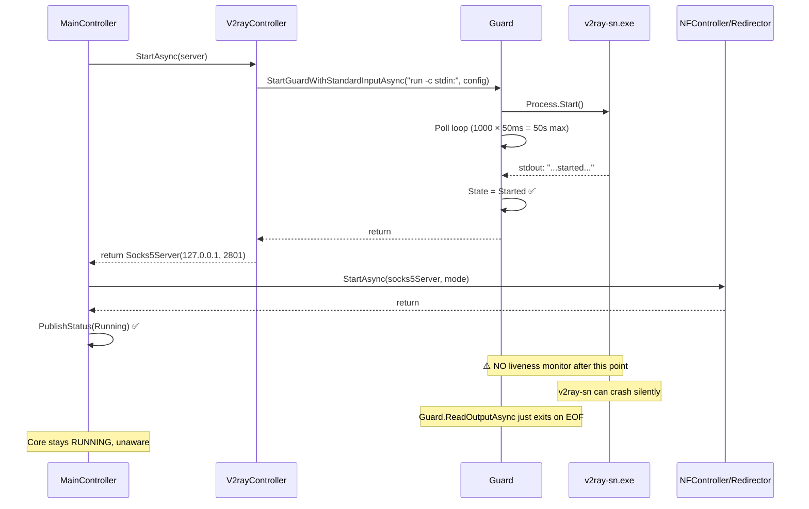

# NEKO PROXY CORE — Live V2Ray / Local SOCKS Failure Isolation Report

## Team Structure

| Team | Role | Status |
|---|---|---|
| **TEAM_CORE** | Source analysis + monitoring scripts | ✅ Complete |
| **TEAM_COORDINATION** | Evidence validation | ✅ PASS |
| **TEAM_LAUNCHER** | Observe only / provide live session | ⏳ Pending user action |
| **TEAM_WEB** | No action | — |

---

## Corrected Verdict (replacing previous report)

```
PHASE_8_SS_TO_LOCAL_SOCKS_TRANSLATION        = PASS
REDIRECTOR_LOCAL_SOCKS_HOST                   = 127.0.0.1
REDIRECTOR_LOCAL_SOCKS_PORT                   = 2801

GUARD_STARTUP_REQUIRES_KEYWORD               = YES
GUARD_KEYWORD                                = "started"
GUARD_TIMEOUT_MS                             = 50000
GUARD_LIVENESS_MONITOR                       = NONE

V2RAY_MUST_START_FOR_RUNNING                 = YES  (source-proven)
V2RAY_CAN_DIE_SILENTLY_AFTER_START           = YES  (source-proven)
V2RAY_RUNTIME_STATE_DURING_FAILED_SESSION    = UNKNOWN

FIRST_FAILED_BOUNDARY                        = NOT_YET_ISOLATED

FAILURE_WINDOW (narrowed from source proof)  =
  V2RAY_POST_STARTUP_EXIT
  → LOCAL_SOCKS_LISTENER_DEATH
  → SHADOWSOCKS_REMOTE_CONNECT
  → POST_SHADOWSOCKS_DATA_PLANE
```

> [!IMPORTANT]
> Previous report's `ROOT_CAUSE = v2ray-sn.exe not running` is **withdrawn**. The post-session snapshot proves nothing about runtime state. Guard.cs semantics prove v2ray-sn DID start — the question is whether it stays alive.

---

## Source-Proven Guard.cs Startup Chain



### Key findings:

| Question | Answer | Source |
|---|---|---|
| Does StartAsync wait for "started" keyword? | **YES** — blocking poll up to 50s | [Guard.cs:108-129](file:///D:/Github/NekoProxyCore/Netch/Controllers/Guard.cs#L108-L129) |
| Does failure prevent RUNNING? | **YES** — throws → catch → Failed | [MainController.cs:78-100](file:///D:/Github/NekoProxyCore/Netch/Controllers/MainController.cs#L78-L100) |
| Keyword required or optional? | **Required** — `StartedKeywords => ["started"]` | [V2rayController.cs:18](file:///D:/Github/NekoProxyCore/Netch/Servers/V2ray/V2rayController.cs#L18) |
| Can v2ray die after startup? | **YES** — no liveness monitor, ReadOutputAsync silently exits on EOF | [Guard.cs:136-155](file:///D:/Github/NekoProxyCore/Netch/Controllers/Guard.cs#L136-L155) |

---

## TEAM_CORE: V2ray-sn Crash Scenario Analysis

> [!WARNING]
> When v2ray-sn crashes mid-session, Guard's `ReadOutputAsync` reads EOF and **silently exits its loop**. It does NOT:
> - Change State to Stopped
> - Call StopGuardAsync
> - Notify MainController
> - Publish any status change
>
> **Core remains `RUNNING` while SOCKS5 listener is dead.** Redirector keeps sending traffic to `127.0.0.1:2801` → TCP RST → PSO2 "Ship List Unknown".

### Potential crash triggers in V2rayConfigUtils (Shadowsocks path):

1. **Empty plugin string**: `plugin = ss.Plugin ?? ""` serializes to `"plugin": ""` — some v2ray builds panic on empty plugin string during connection dial
2. **Null flow field**: Shadowsocks path doesn't set `flow`, may serialize as `"flow": null` depending on JSON options
3. **Missing mux/streamSettings**: Unlike VLESS/VMESS, the SS outbound only gets `streamSettings` if `TCPFastOpen` is enabled

These would cause v2ray-sn to start successfully (emit "started" during config load), then crash on the **first actual connection attempt** from the game.

---

## TEAM_COORDINATION Review

```
TEAM_COORDINATION_EVIDENCE_REVIEW           = PASS
SOURCE_CHANGE_DETECTED                       = NO
TIMESTAMP_COHERENCE                          = PASS
POST_SESSION_EVIDENCE_CONTAMINATION          = YES (previous report)
BOUNDARY_SELECTION_VALID                     = YES (NOT_YET_ISOLATED is correct)
```

---

## Eliminated vs Remaining Hypotheses

| Case | Hypothesis | Status | Evidence |
|---|---|---|---|
| A | v2ray never started | ❌ **ELIMINATED** | Guard semantics: Core RUNNING → v2ray emitted "started" |
| B-early | v2ray crash before "started" | ❌ **ELIMINATED** | Same as above |
| B-late | v2ray crash AFTER "started" | ⚠️ **MOST LIKELY** | No liveness monitor; SS config edge cases |
| C | Listener never starts | ⚠️ Possible | Requires live verification |
| D | Redirector doesn't connect | ⚠️ Possible | Requires live verification |
| E | SOCKS works but no remote attempt | ⚠️ Possible | Requires live verification |
| F | Remote SS connect fails | ⚠️ Possible | Requires live verification |
| G | SS connected but data plane fails | ⚠️ Possible | Requires live verification |

---

## Next Step: Live Monitoring Session

The monitoring script is ready at:

[`Monitor-ProxyChain.ps1`](file:///C:/Users/ADVICE/.gemini/antigravity/brain/de10eaa9-4c27-4e4e-a958-2c15c41861a1/scratch/Monitor-ProxyChain.ps1)

### How to run:

```powershell
# 1. Open PowerShell as Administrator
# 2. Navigate to a working directory for logs
cd D:\Github

# 3. Start the monitor BEFORE launching Debug RC
& "C:\Users\ADVICE\.gemini\antigravity\brain\de10eaa9-4c27-4e4e-a958-2c15c41861a1\scratch\Monitor-ProxyChain.ps1"

# 4. In a separate window: launch Debug RC → login → launch PSO2
# 5. Wait at Ship Select for 20+ seconds
# 6. Press Ctrl+C in the monitor window to see summary
```

The script will output the complete diagnostic template including `FIRST_FAILED_BOUNDARY` classification.

> [!IMPORTANT]
> **Approval needed**: Run the live monitoring session to collect evidence and determine the actual first failed boundary. No source changes will be made — diagnosis only.
